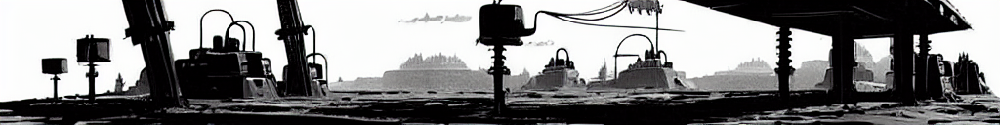

# genai_gazzete

Python project to create summarization and image recreation about main GenAI and LLMs news, post and articles

Tutorial instructions for notebook example:
- Open in Google colab and use a T4 GPU instance
- Clone [github](https://github.com/VictorPelaez/genai_gazzete) repository
- Install all python dependences
- **Get api key** from [newsapi.org](https://newsapi.org/docs/client-libraries/python) and set it in config.ini file
- Run Summarization model to get all the article summaries
- Run Document generation with Images to get a docx file as a newsletter
